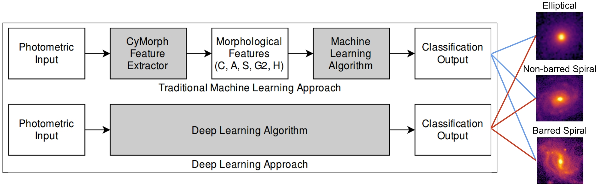

Senior Machine Learning Engineer with 10+ years of professional experience mixing industry and research.
Focused on Machine Learning-based innovation projects - experienced with video analytics, computer vision, reinforcement learning and other approaches for recommendations.
Mostly interested in best practices and automation in Machine Learning-based projects for significant leverage in the mid/long-term. Experienced with Software Engineering in innovation projects.

PhD in Applied Computing - National Institute for Space Research (INPE) - Thesis: Machine and Deep Learning applied to galaxy morphology.
Former PhD Research Fellow at the Physics Department in Brandeis University (USA).
Master's and Bachelor's degree in Computer Science (with Artificial Intelligence focus) at Federal University of São Carlos (UFSCar-Brazil).

 Main investigation of my PhD -- Machine and Deep Learning Applied to Galaxy Morphology ([arXiv](https://arxiv.org/abs/1901.07047) | [ScienceDirect](https://www.sciencedirect.com/science/article/pii/S2213133719300757)).

General Interest
======
- Machine Learning-based systems and projects
- Machine Learning Engineering / MLOps
